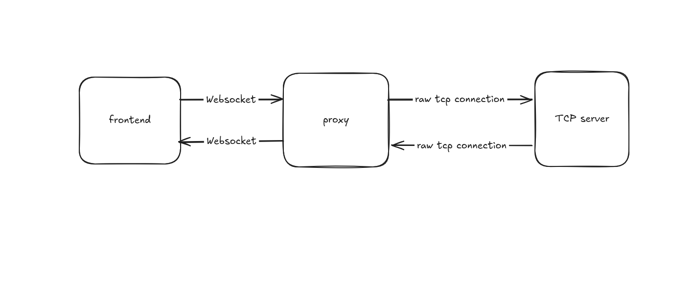
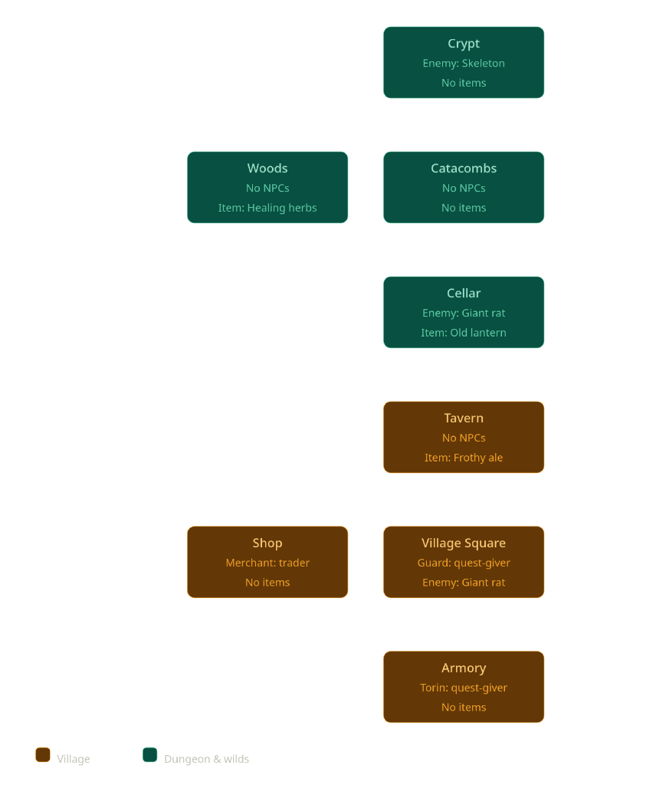

*This activity has been created as part of the 42 curriculum by rfeghali, mmoskale.*

## Description

The Answer Protocol (TAP) is a multiplayer retro text-adventure engine built with a distributed client-server architecture. The project features a concurrent TCP game server written in Go, a lightweight command-line interface (CLI) client, and a modern single-page graphical interface (GUI) built with React 19, TypeScript, and Vite.

Players connect to a shared, persistent-feeling world loaded from static configuration files (`data.json`). The system supports synchronized multiplayer exploration, real-time multi-channel chat (Global, Room, Group), dynamic item manipulation without duplication, an interactive turn-based combat system, NPC dialogues, quest trees with prerequisites, and cooperative player grouping.

## Instructions


### Quick Start

1. **Install dependencies**:
```bash
make install
```

2. **Launch the backend server** (Terminal 1):
```bash
make run-server
```

3. **Choose your client interface**:
* **Option A: Graphical Web Client (GUI)**
Start the WebSocket-to-TCP bridge proxy (Terminal 2):
```bash
make run-proxy
```


Start the frontend web application (Terminal 3):
```bash
make run-client-gui
```

Open `http://localhost:4173` in your browser.
* **Option B: Terminal CLI Client** (Terminal 2):
```bash
go run ./cli-client/cli_client.go <username>
# Or using make:
make run-client
```

## Resources

### References & Documentation

* **RFC 42TAP Specification**: Internal project standard for status responses.
* **Go Concurrency & Networking**: Official Go `net` package documentation, Go Memory Model, and synchronization primitives (`sync.Mutex`, `sync.RWMutex`).
* [**Gorilla WebSocket**](https://pkg.go.dev/github.com/gorilla/websocket) for bidirectional streaming between browser clients and network sockets.
* **React 19 Documentation**: Modern hooks, state handling, and component lifecycles.

### AI Usage Disclosure

* **World Topology Drafting**: Assisting in generating the topological room layout graph and creative lore descriptions in `data.json` to ensure loop and branch constraints were met.
* **Readme structure**


## Architecture



### Concurrency Model & Connection Lifecycle

The server operates on an asynchronous goroutine-per-connection concurrency model:

* **Main Listener**: A master goroutine binds to port `:8090` and continuously accepts incoming TCP connections.
* **Client Handlers**: Each accepted connection spawns an isolated goroutine running `handleConnection`. It manages non-blocking line-by-line reading with `bufio.Reader` and writes back via a thread-safe buffered writer (`bufio.Writer`).
* **Synchronization**:
* **Server-level Mutex (`sync.RWMutex`)**: Protects global maps (connected player registry `players`, active parties `groups`, and mutable world instances). Read locks (`RLock`) allow concurrent state inspections (`WHO`, `LOOK`, broadcasts), while write locks (`Lock`) guarantee safety during player additions, disconnections, and item movements.
* **Player-level Mutex (`sync.Mutex`)**: Guarantees individual transaction safety across player attributes (health points, current location, combat flags, inventories, and active quests).


* **Graceful Teardown**: Connection drops trigger defer statements that unregister the player, release locks, recalculate server metrics, clean up party memberships, and notify the remaining players in the room with presence events before socket closure.

### Web Client Gateway (Proxy Bridge)

Browsers cannot open arbitrary raw TCP sockets directly due to sandbox security policies. To allow the React client to communicate seamlessly with the TCP game server without modifying the core server's network stack:

* A lightweight gateway proxy (`proxy/main.go`) listens on HTTP/WebSocket port `:8080/ws`.
* Upon a client WebSocket handshake, it dials `tcp://localhost:8090` and establishes a full-duplex, bidirectional byte pipe translating WebSocket frames to newline-terminated TCP text lines and vice versa.


## Protocol Implementation

Communication follows the line-based **RFC 42TAP** standard. Every transmission is UTF-8 encoded and terminated by a single newline character (`\n`).

### Message Framing & Syntax

1. **Client Request**:
```text
<COMMAND> [ARGUMENTS...]\n
```


2. **Server Success Response**:
```text
OK [DATA | JSON_PAYLOAD]\n
```


3. **Server Error Response**:
```text
ERR <code> <MESSAGE>\n
```

4. **Server Asynchronous Broadcast Event**:
```text
EVT <SCOPE> <EVENT_TYPE> [PAYLOAD...]\n
```

### Protocol Compliance & Structured Payloads

The implementation strictly honors the core commands: `CONNECT`, `QUIT`, `LOOK`, `MOVE`, `CHAT`, `WHO`, `GROUP`, `TAKE`, `DROP`, `INVENTORY`, `STATUS`, `ATTACK`, `FLEE`, `TALK`, `QUEST`, `QUESTS`, and `ABANDON_QUEST`.

To keep both the CLI and modern graphical interfaces synchronized with complex game state without custom ad-hoc delimiters, structured responses return serialized JSON payloads after the `OK ` prefix (defined in `common/api.go`):

* `LOOK` returns `{"type":"room", "room":{...}, "players":[...], "items":[...], "npcs":[...]}`.
* `INVENTORY` returns `{"type":"inventory", "items":[...]}`.
* `STATUS` returns `{"type":"status", "hp":100, "max_hp":100, "status":"healthy"}`.
* `GROUP DISPLAY` returns `{"type":"group", "group_list":[...], "my_group":"..."}`.

### Error Codes

The server uses standard three-digit numeric error codes:

| Code | Identifier | Description |
| --- | --- | --- |
| **201** | `NAME_IN_USE` | The requested nickname is already registered by an active player. |
| **301** | `NO_EXIT` | Attempted movement in an invalid direction with no exit. |
| **400** | `INVALID_ARGS` / `UNKNOWN_COMMAND` | Malformed command syntax, wrong argument count, or unknown command. |
| **401** | `NOT_AUTHENTICATED` | Attempted to issue gameplay commands prior to running `CONNECT <username>`. |
| **403** | `CANNOT_MOVE_IN_COMBAT` | Room transitions are prohibited while actively engaged in combat. |
| **404** | `ITEM_NOT_FOUND` / `NPC_NOT_FOUND` | Target entity does not exist in the current room or inventory. |
| **405** | `NPC_NOT_HOSTILE` | Attack command issued against a passive or friendly NPC. |
| **406** | `QUEST_*` / `NO_QUEST_AVAILABLE` | Quest criteria error (already accepted, completed, abandoned, or missing prerequisite). |
| **409** | `INVENTORY_FULL` / `ALREADY_IN_COMBAT` | State conflict (e.g. inventory cap reached or attacking a second target). |
| **413** | `MESSAGE_TOO_LONG` | Payload exceeded the maximum allowable message size (104 bytes buffer limit). |
| **429** | `CHAT_RATE_LIMIT_EXCEEDED` | Chat flood threshold surpassed (>10 messages per minute). |
| **500** | `COMMAND_ERROR` | Internal server execution error. |
| **503** | `SERVER_FULL` | Maximum concurrent player connection capacity reached. |

---

## Combat System

Combat is turn-based and driven on-demand per player command exchange. Combat engagements are tracked at the player state level.

### Mechanics & Formula

* **Initiation**: An encounter starts when a player issues `ATTACK <npc_id | npc_name>`. The server verifies that the target exists in the room and has `hostile: true`.
* **Damage Calculation**:

$$\text{Damage} = \max(1, \text{Attacker.Attack} - \text{Target.Defense})$$


Damage can never fall below a minimum threshold of $1$.
* **Exchange Loop**:
1. The player strikes the enemy NPC, deducting calculated player damage from the NPC's health points.
2. If the NPC survives, it immediately counter-attacks using the same formula: $\max(1, \text{NPC.Attack} - \text{Player.Defense})$.
3. The server updates both combatants' HP, returns an `OK {"type":"combat", ...}` response, and broadcasts an `EVT ROOM COMBAT ...` action summary to all players in the room.


### Defeat & Respawn

* **NPC Defeat**: When an NPC drops to $0$ HP, it is removed from the room's spawn list. The server emits an `EVT ROOM KILL` event, triggers quest progress checks (`defeat_npc`), clears combat flags, and awards quest credit.
* **Player Defeat**: When player HP reaches $0$, combat ends immediately. The player's state is reset to `healthy`, HP is restored to $50\%$ of maximum ($\text{MaxHP} / 2 = 50$), and the player is instantly relocated to the `start` room (`Village Square`). Appropriate leave/enter presence broadcasts are transmitted to the respective rooms.

### Tactical Evasion (`FLEE`)

A player engaged in combat can attempt to escape using `FLEE`:

* **Success Rate**: $50\%$ chance (`rand.Intn(100) < 50`).
* **Success Result**: Combat state is cleared, status returns to `healthy`, and the player remains in the room without penalty.
* **Failure Penalty**: If evasion fails, the player loses $5$ HP and remains locked in combat with the target.


## Quest System

Quests are managed per player and support non-linear narrative progression, objective validation, and chained dependencies.

### Lifecycle & State Transitions

```
[Available on NPC] 
       │
       ▼ (QUEST <npc>)
   [Active] ─────────────► [Abandoned] (ABANDON_QUEST <id>)
       │
       ▼ (Target conditions fulfilled)
  [Completed] (Immediate reward distribution)

```

* **Prerequisites (`requires`)**: Quests can specify dependencies. If a quest requires another quest ID that is not yet marked as `completed`, the server rejects acceptance with `ERR 406 QUEST_PREREQUISITE_NOT_MET`.
* **Duplicate Protection**: Players cannot accept duplicate quests. Re-requesting an active quest yields `QUEST_ALREADY_ACCEPTED`, while completed quests return `QUEST_ALREADY_COMPLETED`.
* **Permanent Abandonment**: Players can voluntarily abandon active quests using `ABANDON_QUEST <id>`. Once marked as `abandoned`, the quest is permanently locked out to prevent state exploits.

### Objective Validation

* **`fetch_item`**: Automatically verified when executing `TAKE`. Upon acquiring the required item, the quest resolves, the item target is consumed from the inventory, the reward item is deposited, and group/room completion events are emitted.
* **`defeat_npc`**: Automatically verified when an NPC is slain during combat resolution.


## World Design

The world configuration is defined in `data.json` and parsed into memory on boot.




### Locations (8 Interconnected Rooms)

1. **Village Square (`start`)**: The central hub with cobblestone paths, fountain, and starting spawn point.
2. **The Prancing Pony (`tavern`)**: Cozy rest stop north of the square; contains `ale`.
3. **Tavern Cellar (`cellar`)**: Cool cellar connected east of the tavern; infested with a `giant_rat`.
4. **Ancient Catacombs (`catacombs`)**: Subterranean passage linking the cellar to deep underground vaults and woods.
5. **Forgotten Crypt (`crypt`)**: Burial chamber north of the catacombs guarded by an aggressive `skeleton`; holds the `silver_amulet`.
6. **Whispering Woods (`woods`)**: Surface pine forest linking the catacombs back to the general store; contains `healing_herbs`.
7. **General Store (`shop`)**: Trading outpost west of the square, completing the western loop.
8. **Blacksmith & Armory (`armory`)**: Branching south off the square; home of the dwarf blacksmith forge.

### NPCs & Roles

* **Village Guard (`guard`)**: Dialogue NPC and quest giver for `clear_cellar`.
* **Shop Keeper (`merchant`)**: Friendly commercial dialogue NPC.
* **Blacksmith Torin (`blacksmith`)**: Master artisan and quest giver for `lost_amulet`.
* **Giant Cellar Rat (`giant_rat`)**: Hostile rodent ($15$ HP, $6$ Atk, $1$ Def).
* **Crypt Skeleton (`skeleton`)**: Hostile reanimated warrior ($35$ HP, $12$ Atk, $4$ Def).

### Quests

1. **Cellar Trouble (`clear_cellar`)**:
* *Giver*: Village Guard (`guard`)
* *Type*: `defeat_npc` (Target: `giant_rat`)
* *Reward*: `test` item


2. **The Blacksmith's Heirloom (`lost_amulet`)**:
* *Giver*: Blacksmith Torin (`blacksmith`)
* *Requires*: Completion of `clear_cellar`
* *Type*: `fetch_item` (Target: `silver_amulet`)
* *Reward*: `iron_sword`


## Server Logging

The server incorporates a thread-safe structured logger (`logging.go`) with ANSI color-coding and millisecond-accurate timestamps:

```text
17:42:01 INFO  Client connection opened from 127.0.0.1:54320
17:42:05 INFO  Player authenticated: username=Hero address=127.0.0.1:54320
17:42:10 INFO  Command received: player=Hero command=MOVE args=[north]
17:42:10 INFO  World state changed: player=Hero move from=start to=tavern
17:42:18 INFO  QUEST_ACCEPT player=Hero quest=clear_cellar npc=Village Guard room=start
17:42:25 INFO  Combat: player=Hero npc=Giant Cellar Rat damage=11 counter=0 npc_hp=4 player_hp=100
17:42:27 INFO  NPC_DEFEATED player=Hero npc=Giant Cellar Rat room=cellar
17:42:27 INFO  QUEST_COMPLETE player=Hero quest=clear_cellar type=defeat_npc target=giant_rat reward=test
17:42:30 WARN  LIMIT: Chat rate limit exceeded: player=Hero count=11
```

### Logged Event Categories

* **Connection Lifecycle**: Tracks incoming connections, remote IP addresses, successful authentications, and terminations.
* **Commands & Dispatches**: Logs every incoming raw line command and associated parameters.
* **World State Changes**: Real-time room transitions, item pick-ups (`TAKE`), and room drops (`DROP`).
* **Combat Telemetry**: Attacker and counter-attack damage dealt, current remaining HP pools, victories, player deaths, and respawns.
* **Quest Progression**: Full audit trail recording `QUEST_ACCEPT`, `QUEST_COMPLETE`, `QUEST_REWARD`, and quest abandonment.
* **Security & Abuse Detection**:
* **Command Flooding**: Triggers warnings if a client exceeds $20$ commands within a one-second sliding window.
* **Chat Rate Limiting**: Enforces a strict threshold of $\le 10$ messages per minute. Exceeding messages are dropped with error code `429`.
* **Rapid Connection Spikes**: Flags alerts when anomalous connection churn occurs (>2 connections per minute).
* **Server Capacity**: Rejects connections beyond $100$ concurrent players with error code `503`.


---

## Group Contributions

* **`rfeghali`**:
* Designed and implemented the Go TCP server core networking pipeline, socket listeners, and connection lifecycle routines.
* Built the central `CommandRegistry` router, input argument validators, and dispatch logic.
* Implemented the turn-based combat calculations, damage resolution formulas, and fleeing mechanics.
* Developed the Go terminal CLI client (`cli-client/cli_client.go`) with asynchronous background event polling and command prompt loops.


* **`mmoskale`**:
* Designed and developed the React 19 + TypeScript graphical user interface (GUI), including real-time panel layouts (Room View, Chat & Logs, Inventory, Actions, and Party status).
* Built the WebSocket-to-TCP bridge proxy (`proxy/main.go`) to enable full-duplex communication between web browsers and raw TCP game sockets.
* Implemented the world schema parser and integrity validator (`parsing.go`), ensuring bidirectional exits, reference integrity, and unique quest rewards.


## Building and Running

All targets are coordinated through the root `Makefile`:

```bash
# Install toolchains, linter, and frontend packages
make install

# Start the TCP backend server (Port 8090)
make run-server

# Start the WebSocket proxy bridge (Port 8080)
make run-proxy

# Run the CLI client
make run-client

# Run the GUI web client in development mode (Vite HMR on Port 5173)
make run-client-gui-dev

# Build and preview the GUI client for production (Port 4173)
make run-client-gui

# Run linters across Go and TypeScript
make lint

# Remove dependencies and build artifacts
make clean
```

## Testing

### 1. Multiplayer & Synchronization Test

1. Launch the server and proxy:
```bash
make run-server
make run-proxy
```


2. In separate terminals, open two clients (e.g. one GUI at `http://localhost:5173` and one CLI via `go run ./cli-client/cli_client.go Bob`).
3. Connect with unique nicknames on both.
4. Verify that:
* Both clients receive `EVT STATS players=2`.
* When one player moves into the other player's room, an `EVT ROOM PRESENCE ENTER <name>` event is displayed in real time.
* Sending a message in `ROOM` chat only displays to players in the same room.
* Sending a message in `GLOBAL` chat broadcasts to both clients across different locations.


### 2. Item Exclusivity (No Duplication)

1. Navigate both players to `start` (`Village Square`).
2. Player 1 executes `TAKE silver_amulet`.
3. Check Player 2's room view: the amulet disappears instantly from the room.
4. Player 2 attempts `TAKE silver_amulet` $\rightarrow$ receives `ERR 404 ITEM_NOT_FOUND`.
5. Player 1 executes `DROP silver_amulet`.
6. The item reappears immediately in Player 2's room view and can now be picked up by Player 2.

### 3. Combat & Death Loop Test

1. Navigate to the `cellar` where the `giant_rat` spawns.
2. Issue `ATTACK giant_rat`.
3. Observe player damage, enemy HP reduction, counter-attack damage, and synchronized room combat broadcasts.
4. Attempt `MOVE north` while fighting $\rightarrow$ verifies `ERR 403 CANNOT_MOVE_IN_COMBAT`.
5. Issue `FLEE` $\rightarrow$ verifies $50\%$ chance of escape or $5$ HP damage penalty.
6. Continue attacking until the rat reaches $0$ HP $\rightarrow$ rat is removed from the room, `EVT ROOM KILL` is broadcast, and quest completion triggers.

### 4. Quest Dependency & Progression Test

1. Talk to Blacksmith Torin: `QUEST blacksmith` $\rightarrow$ rejected with `ERR 406 QUEST_PREREQUISITE_NOT_MET` because `clear_cellar` is required first.
2. Talk to the Village Guard: `QUEST guard` $\rightarrow$ accepts quest `clear_cellar`.
3. Defeat the `giant_rat` in the cellar $\rightarrow$ quest automatically finishes, distributing the `test` item.
4. Return to the Blacksmith: `QUEST blacksmith` $\rightarrow$ now succeeds, setting `lost_amulet` to active.
5. Retrieve the `silver_amulet` from the crypt $\rightarrow$ quest detects item pickup, awards `iron_sword`, consumes the amulet from inventory, and updates status to completed.
6. Attempt to take the quest again $\rightarrow$ rejected with `ERR 406 QUEST_ALREADY_COMPLETED`.